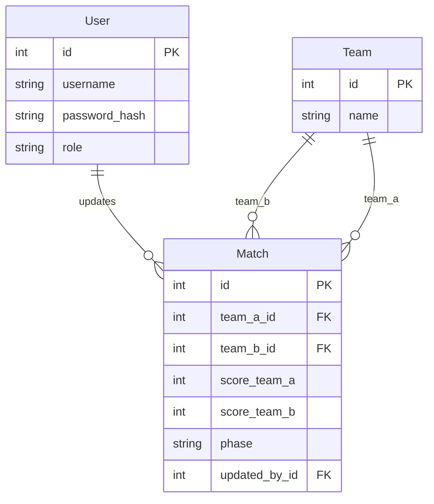

# how to run:

1. clone repo
2. create .env file and set these variables:
    - MYSQL_ROOT_PASSWORD
    - MYSQL_DATABASE
    - SECRET_KEY
3. run docker compose up -d --build

- Frontend:  http://localhost:5173
- Backend:   http://localhost:8000
- API-Docs:  http://localhost:8000/docs

Database Model:
